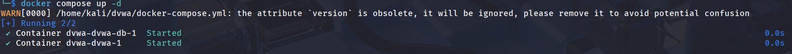
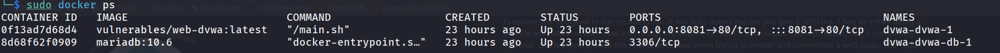

# DVWA Setup
- This project documents how I set up the Damn Vulnerable Web Application (DVWA) in my local pentesting lab.
- DVWA is a purposely insecure web application created by the community at DVWA on [GitHub](https://github.com/digininja/DVWAhttps://github.com/digininja/DVWA).
-  It is designed to help learners like me practice and understand real-world web vulnerabilities such as SQL Injection, Cross-Site Scripting (XSS), Command Injection, File Upload flaws, and many more.
- The setup is simple to create, safe and in a controlled environment where I can experiment, break things, and learn how web attacks actually work, without risking any real systems.
- This project walks through the process of running DVWA locally using Docker containers, making it quick to deploy and easy to reset if something breaks.

---
# Setup
## Installing Docker on Kali--  
```
sudo apt update && sudo apt upgrade -y         # Update to the latest packages 
sudo apt install -y docker.io docker-compose   # To install the docker engine and docker compose on the main system
```
## Download the docker-compose.yml 
Download and save the file in a seperate DVWA folder. The file contains all the necesaary DVWA container configuration information.

## Go to the DVWA folder via termianl

## Start the lab 
```
sudo docker compose up -d
```
You should see this if the docker container is running perfectly.

## Check containers
```
sudo docker compose ps 
```
You should see this if the installation is success


## Open DVWA in browser:
- http://localhost:8081
# Default login: 
- admin - admin
- password -password

# To stop the lab
```
sudo docker compose down
```
# To remove volumes and reset DB (destructive)
```
sudo docker compose down --volumes
```

---


