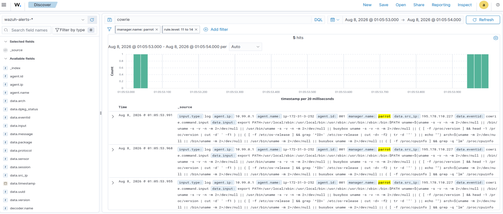

# SSH Bruteforce attack

# Alert Triage 

### Severity level - High
---

### Incident Summary
 - Multiple SSH login attempts were made to the AWS EC2 instance with (agent id: 001) followed by successful login to the machine, on Aug 7, 2026 @ 20:58:06.869 from the src_ip 195.178.110.227, where it ran commands to fingerprint the system and tests for sandbox indicators in a very short span of time.     

 ---

### Threat Intelligence 

-  **AbsueIPDB** - The IP was reported 29,381 times.
-  **Virstotal** - The IP is flagged by 14 vendors.

---

### MITRE Attack ID mapping 
- T1110 (Brute Force)
- T1078 (Valid Accounts)
- T1059 (Command and Scripting Interpreter)
    - T1059.004 (Unix Shell)
- T1497 (Virtualization/Sandbox Evasion)
    - T1497.001 (System Checks)
---
### Verdict/Escalation

True Positive - escalation required.

---

### Response and Recommendations 

- Kill the attacker's active session.
- Disable the compromised account.
- Check for persistence.
- Add the IP to Block list.

---

### Filters Used 

- data.src_ip: 195.178.110.227
    - 4 previous login sessions found in short span of time.
- data.input: exsits

    - export PATH=/usr/local/sbin:/usr/local/bin:/usr/sbin:/usr/bin:/sbin:/bin:$PATH
uname=$(uname -s -v -n -m 2>/dev/null || /bin/uname -s -v -n -m 2>/dev/null || /usr/bin/uname -s -v -n -m 2>/dev/null || busybox uname -s -v -n -m 2>/dev/null || ( [ -f /proc/version ] && head -1 /proc/version | cut -d' ' -f1 ) || ( [ -f /etc/os-release ] && grep '^ID=' /etc/os-release | cut -d= -f2 | tr -d '"' ) || echo "")
arch=$(uname -m 2>/dev/null || /bin/uname -m 2>/dev/null || /usr/bin/uname -m 2>/dev/null || busybox uname -m 2>/dev/null || ( [ -f /proc/cpuinfo ] && grep -q "lm" /proc/cpuinfo && echo x86_64 ) || ( [ -f /proc/cpuinfo ] && grep -q "CPU architecture: 8" /proc/cpuinfo && echo aarch64 ) || ( [ -f /proc/cpuinfo ] && grep -q "CPU architecture: 7" /proc/cpuinfo && echo armv7l ) || echo "")
uptime=$(cat /proc/uptime 2>/dev/null || busybox cat /proc/uptime 2>/dev/null)

---
### Lessons learned on further investigation

There are many automated credential stuffing bots in the internet which constantly targets public facing IPs with open ssh ports that are obtained by the mass scanning. Where the bots constantly tries different leaked credential's username and password on the target IP to gain access, than perform automated command execution on the victim machine to confirm the legitmacy of the machine.

After gathering system information, the bot exits within a matter of seconds. If the machine is confirmed valid/authentic, a follow-up payload delivery may be attempted against that IP in a separate session a two-stage pattern also documented externally (SANS Internet Storm Center, "Reconnaissance First: An SSH Bot That Sizes Up Your Hardware Before Deploying a Miner," isc.sans.edu/diary/33198). No follow-up payload was observed in this telemetry.

---
