# Isolated CyberLab

## Introduction

A dual-perspective (red team + blue team) security operations homelab combining on premises virtualized infrastructure with a cloud-hosted virtual private server. Built for hands-on SOC analysis and offensive security practice, with an emphasis on realistic network segmentation and detection engineering.

---

## Architecture

The architecture is designed to simulate a real-world SOC environment, supporting both defensive analysis and offensive practice.

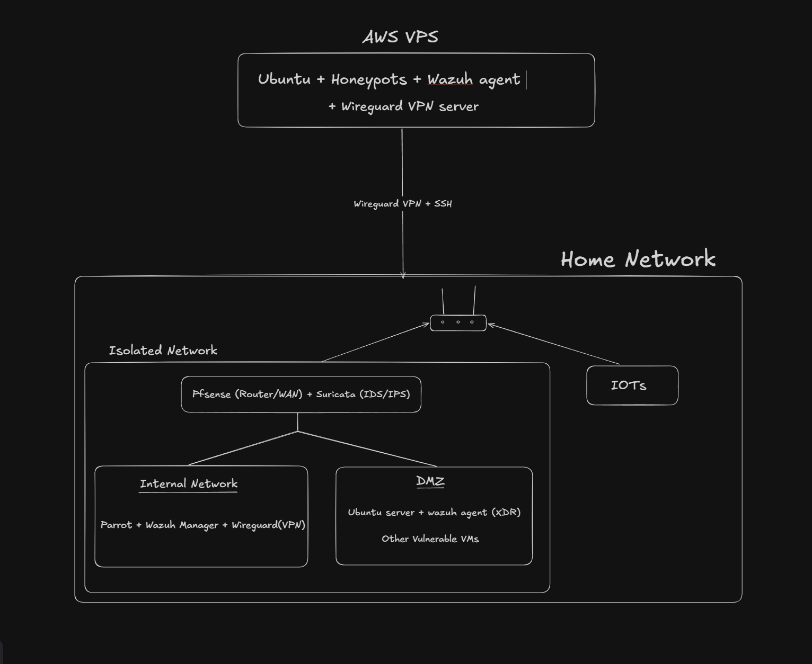

### Pipeline

Traffic hits bait on two fronts, AWS EC2 (Cowrie + OpenCanary, catching real internet scanning) and an on-prem DMZ target (self-directed red-team exercises from Parrot). Both are walled off pfSense enforces that a compromised DMZ or cloud host can't reach the trusted LAN VMs in the internal network.

Logs from the honeypots, Suricata (network IDS), DMZ VMs all flow into Wazuh, EC2's data travels over an encrypted WireGuard tunnel, gets auto-parsed as JSON, and is matched against custom hand-written detection rules (built by triggering real events). Suricata's alerts arrive via pfSense syslog and get unwrapped by a custom decoder before hitting Wazuh's built-in ruleset, which adds automatic MITRE ATT&CK mapping.

---

## Technologies Used

- **VMware** - Hypervisor for deploying and isolating multiple VMs.
- **pfSense** - Router, firewall, and DHCP server providing network segmentation (LAN/DMZ) for the lab.
- **Suricata (IDS)** - Running in alert-only mode on the DMZ interface to monitor and detect malicious traffic.
- **AWS EC2 (VPS)** - Cloud-hosted instance running honeypots (Cowrie, OpenCanary) and a Wazuh agent, connected back to the home lab via WireGuard.
- **Wazuh (SIEM)** - Manager, indexer, and dashboard hosted on-prem (Parrot OS), serving as the central hub for alerts and activity from both DMZ and cloud honeypots.
- **WireGuard (VPN)** - Encrypted tunnel connecting the EC2 instance to the home lab, used to transfer Wazuh agent logs securely.
- **Honeypots** - Cowrie and OpenCanary.

---

## VMware Setup

**1. Configuring the Network Interfaces**

- Go to the Edit --> Virtual Network Editor

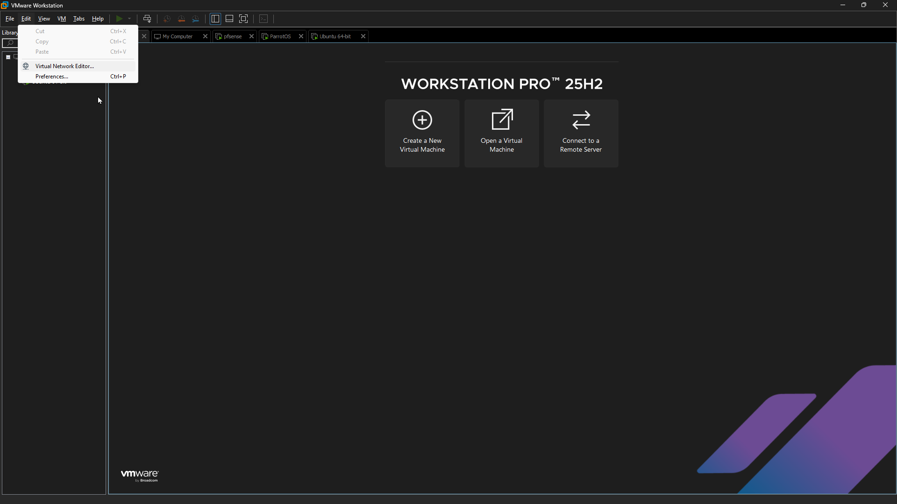

- Add Network interfaces where one interface should be in Bridged mode which will act as the router (WAN) and rest all Host only for isolated (LAN) network. Also turn off the (Use local DHCP services to distribute IP address to VMs) as pfsense will handle it.

    ***Note:***- For ease edit the subnet address to consecutive addresses shown below.
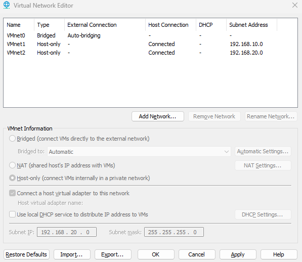

**2. VM Setup**

- Create the VMs of your choice for the Internal/DMZ zone ref: [link](https://www.youtube.com/watch?v=3cK8YHO0fWo) and install the pfsense from <https://www.pfsense.org/download/>

- Now in Virtual Machine Settings according to the network interfaces assign the Network adapter for Internal&DMZ VMs to Host only network interfaces.
Network Adapter --> Custom Specific virtual network --> Select any Host only interface

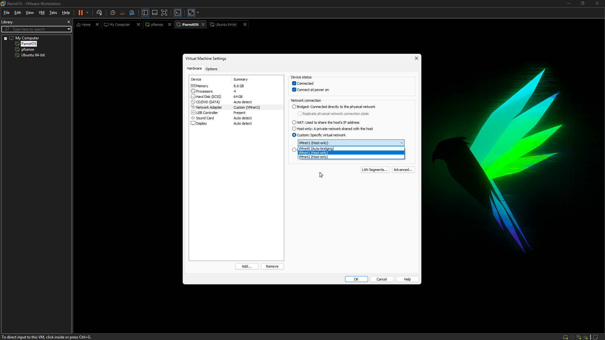

- For pfsense assign one Network adapter to the Bridge network interface which will act as WAN interface. Than add another new Network adapter assign it to any of the Host only network interfaces, similarly add new adapters and assign the remaining host only interfaces to them.
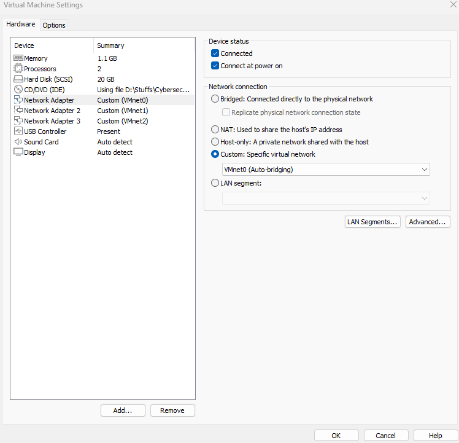
- Now start the pfsense first as we need to setup the routing first for isolated network.

---

## pfsense setup

**1. Installing the pfsense**

- After starting the pfsense VM will prompted the screen below hit enter.
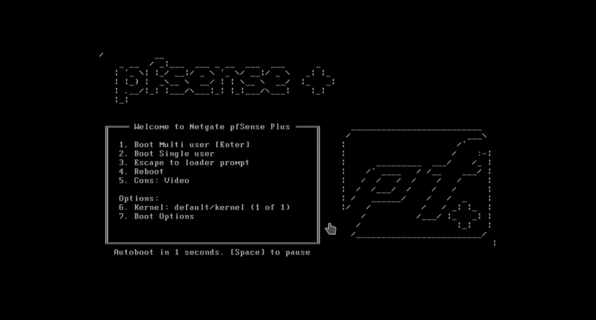
- Now select the WAN interface MAC address.
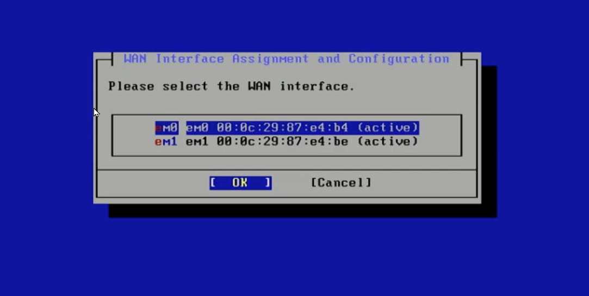
To identify the mac address referrer to pfsense VMware menu --> Edit virtual machine settings --> Network Adapter with the Bridged mode --> Select Advance where the MAC address is located.
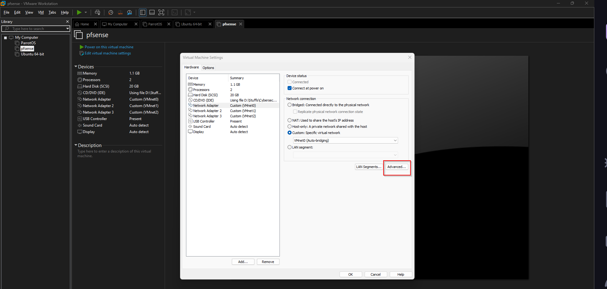
- Similarly identify the LAN/Host-only MAC addresses and press enter.
- Install the CE edition.
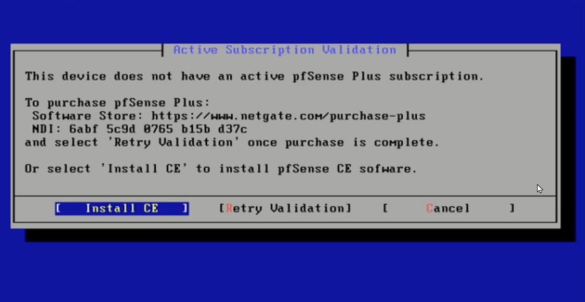
- Continue with the default file system type and disk partition scheme.
- Hit enter with the default disk selection.
- Select the current stable version and let it install, than after installation hit reboot.
- After reboot will land in pfsense console.
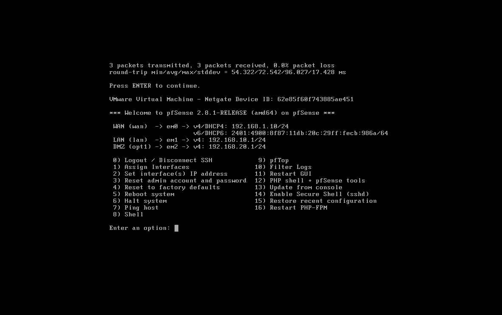

**2. Web GUI**

- From the pfsense console note down anyone of the LAN IP address.
- Than in the attacker VM go to the browser and enter the noted IP address which will land to pfsense web pannel.
**Default** **Username - admin** and **Password - pfsense**

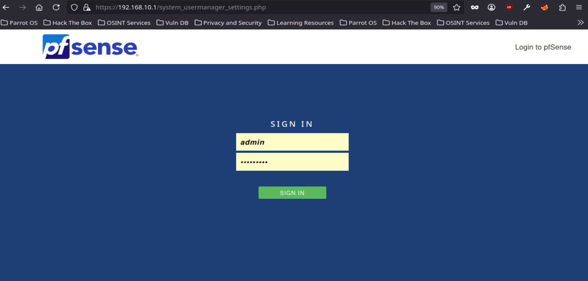

- On the pfSense Setup you can change the Hostname, Domain, Primary DNS Server of your own I have kept it default.

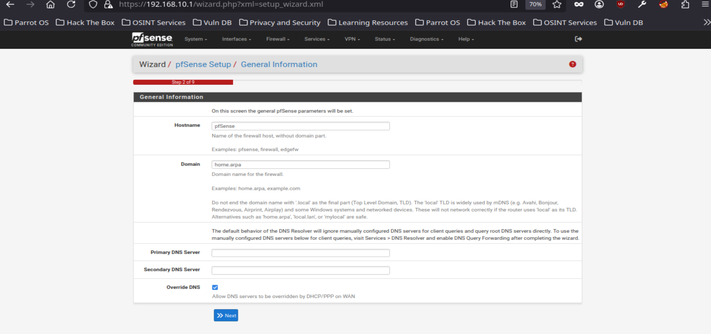

- On the **Time Server Information** page either keep it default or select accordingly.
- On the Configure WAN interface page change the **SelectedType** to DHCP and rest default.
- On the **Configure LAN interface** page keep it default.
- On the **Set Admin WebGUI Password** set the new admin password.
- Click on finish and will land into pfsense dashboard.

**3. WAN & DMZ Interfaces Setup**

- Go to **Interfaces** --> **WAN** verify if **Enable the interface** is checked,the **IPv4 Configuration Type** is in **DHCP**, **IPv6 Configuration Type** in **DHCP6**, rest keep it to default and save it.
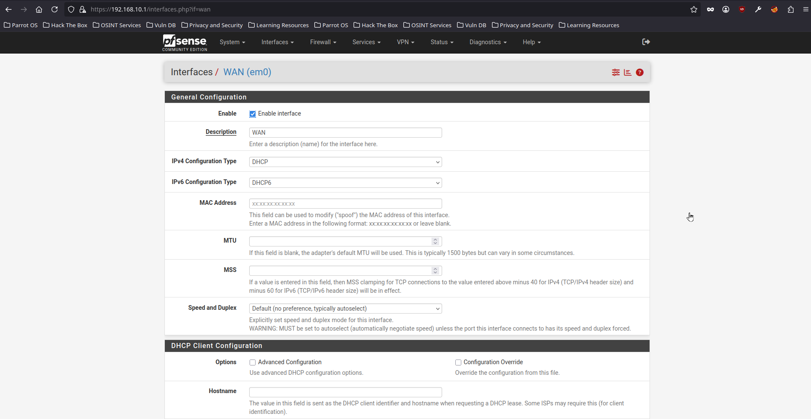
- Now for LAN **Interfaces** --> **LAN** --> change **IPv4 Configuration Type** to Static IPv4 for **IPv6 Configuration Type** to None. In **Static IPv4 Configuration IPv4 address** enter the LAN IP of the attacker/internal network machine with subnet mask /24,uncheck the **Reserved Networks** and save it.
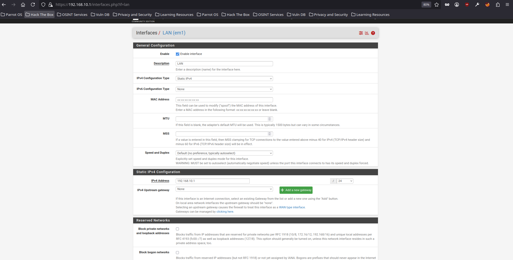

- Now go to Interfaces --> Assignments --> OPT1 --> Enable the interface than change **Description** from OPT1 to DMZ with **IPv4 COnfiguration Type** to Static IPv4 and **IPv6 Configuration Type** to None, assign the DMZ Vm LAN IP with subnet mask /24 on the **Static IPv4 Configuration**, Uncheck the **Reserved Networks** and save it.
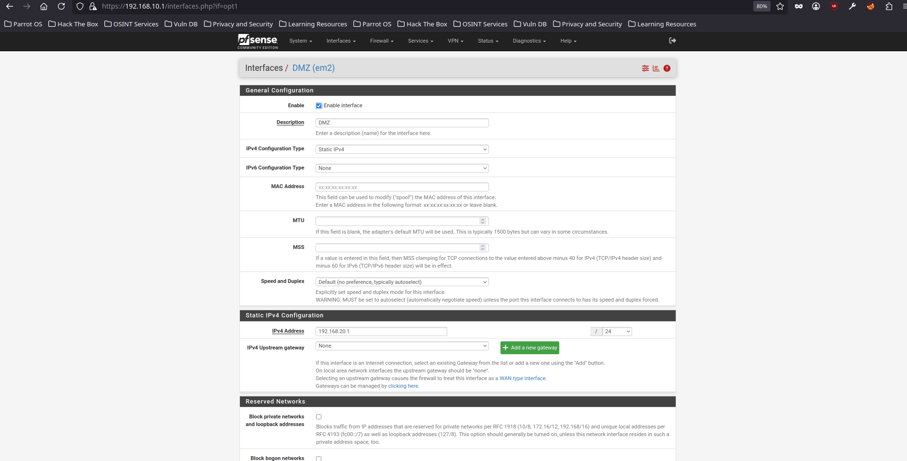

**4. DHCP Server**

- **Services** --> **DHCP Server** --> **LAN** --> Enable DHCP server on LAN interface, in the **Primary Address Pool** set the address pool range from the assigned subnet 192.168.20.100 to 192.168.20.200 and save it.
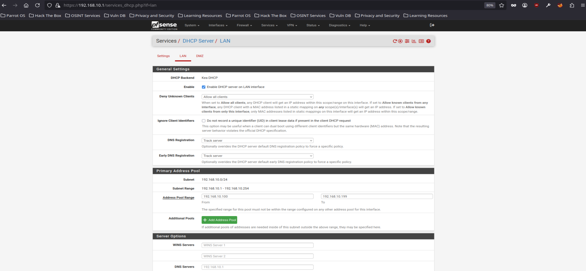
- Similarly for DMZ set the address pool range with respect to the assigned subnet xxx.xxx.xx.100 to xxx.xxx.xx.200 and save it.
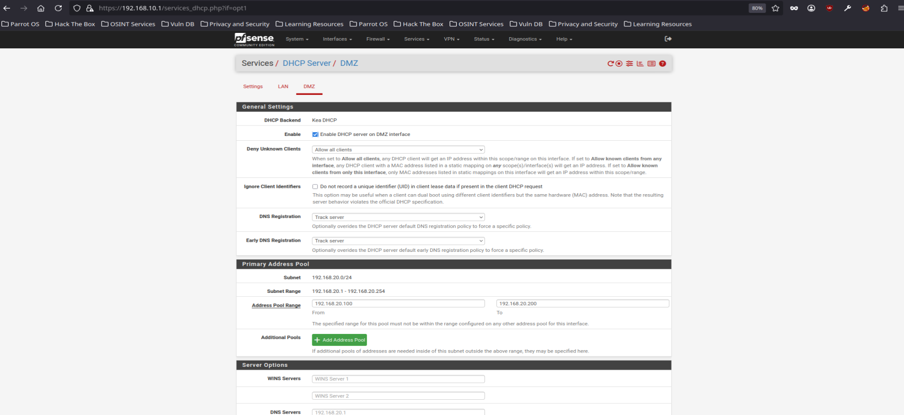

**5. Firewall Rules**

- Go to the **Firewall** --> **DMZ** leave the default rule as it is.
- Click **Add** --> **Action**: Block, **Protocol**: Any, **Source:** DMZnet, **Destination:** LANnet add a **Description:** Block DMZ to LAN and save it
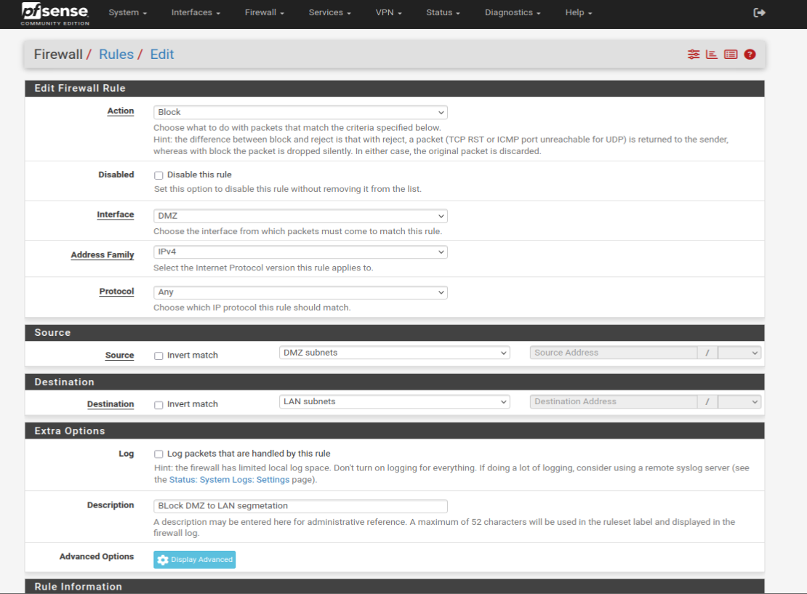
- Similarly add another rule for allowing DMZ wazuh agent to send logs to LAN wazuh manager
**Action:** Pass, **Protocol:** TCP, **Source:**  DMZ subnet, **Destination:** Address or Alias also asign the IP of the LAN VMs IP address, **Destination Port Range**: 1514 to 1515, add the description  and save it.
***Note:*** Drag this rule to the top.
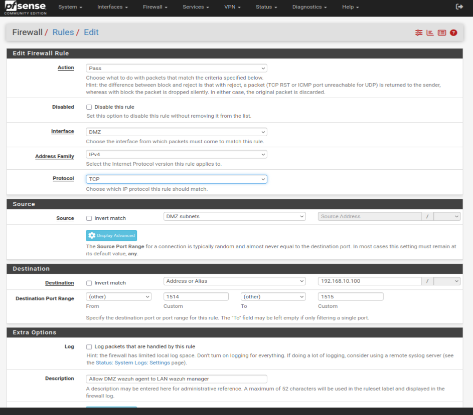
- Similarly add another rule for internet access where **Action:** Pass, **Protocol:**Any, **Source:** DMZnet, **Destination:** Any, **Description:** Allow internet access and save it.
- Final firewall rules for DMZ should looks like the img below
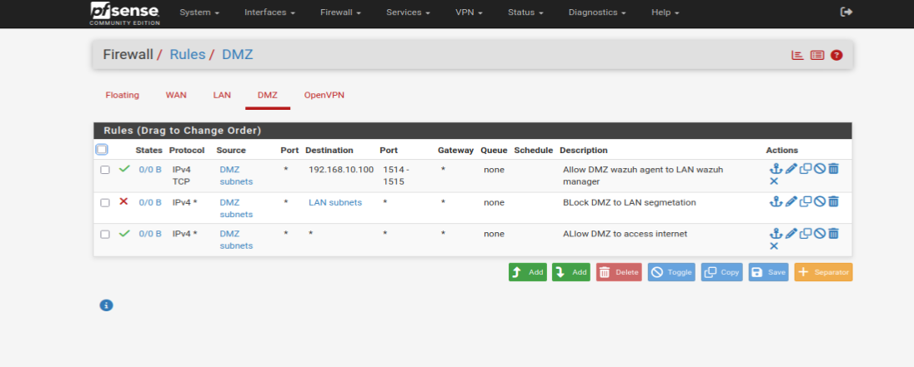
- Now for LAN rules keep the default rules.
- Add a new rule **Action:** Pass, **Protocol:** TCP, **Source:** LAN subnets, **Destination:** DMZ subnets, **Description:** Allow LAN to DMZ, **Destination Port range** : Any to Any and save it.
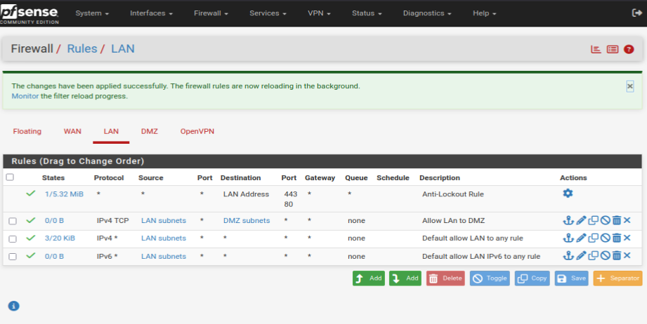

---

## Suricata Setup

**1. DMZ Interface settings**

- Go to **System** --> **Package Manager** --> **Availabe Packages** --> Search for Suricata. Click Install, confirm and wait for it to finish.
- Go to **Services → Suricata**, click **Add**.
- **Enable** Suricata inspection on the interface, then configure:
  - **Interface:** DMZ
  - **Description:** DMZ-IDS
  - **EVE JSON Log:** checked
  - **EVE Log Alert Payload Data Formats:** BOTH
  - **EVE Logged Traffic:** DNS, FTP, HTTP, HTTP2, IKE, Kerberos, NFS, QUICv1, RFB, SMB, SMTP, TFTP all checked
  - **EVE Logged Info:** DHCP Messages, MQTT, SNMP, SSH Handshakes, TLS Handshakes, Tracked Files all checked
  - **EVE Logged Extended:** Extended HTTP Info, Extended TLS Info, Extended SMTP Info checked
- Leave all other settings at their default values.
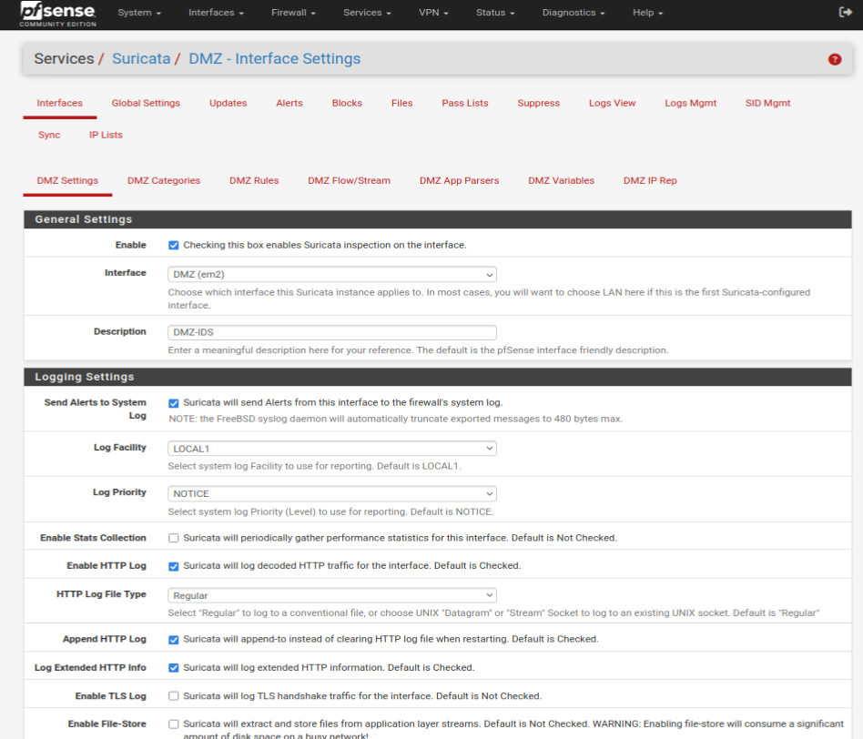
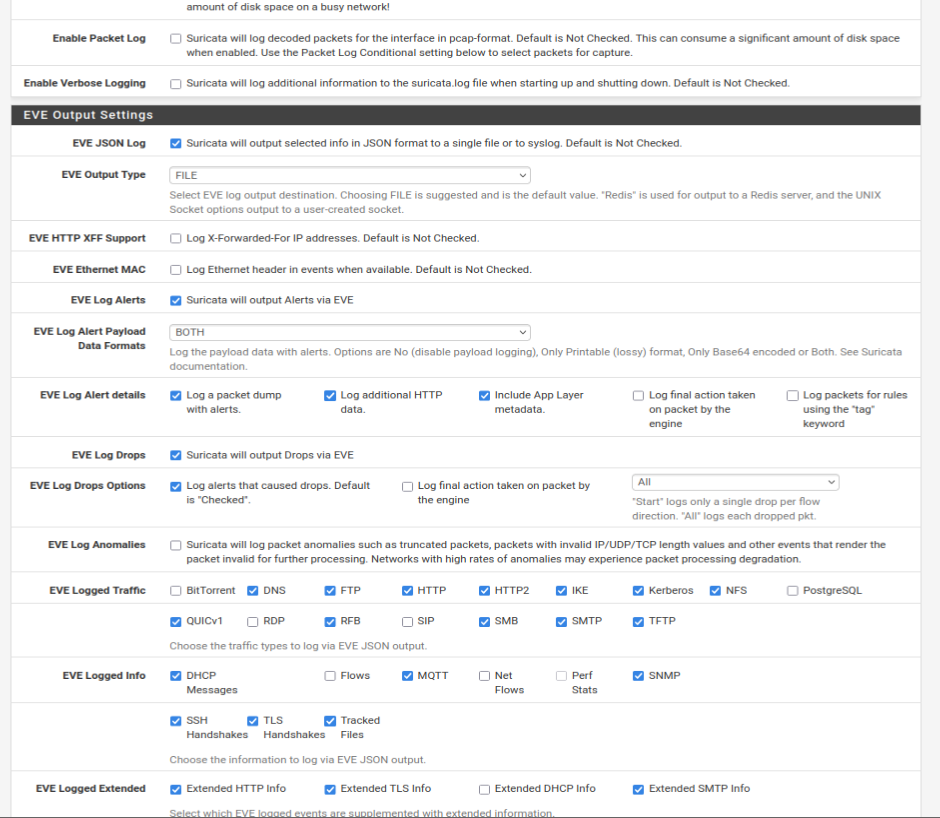
- CLick **Save.**

**2. Threat Detection**

- Go to **Global Settings** --> Check the **Install ETOpen EMerging Threats rules** --> **Save**
- Go to DMZ row --> Edit --> **DMZ Categories**
- Check these rules
  - emerging-scan.rules
  - emerging-exploit.rules
  - emerging-malware.rules
  - emerging-web_server.rules
- **Save** it.

**3. Start the instance**

- Go back to **Services** --> **Suricata** --> Click the play button on the DMZ which will start capturing the alerts.
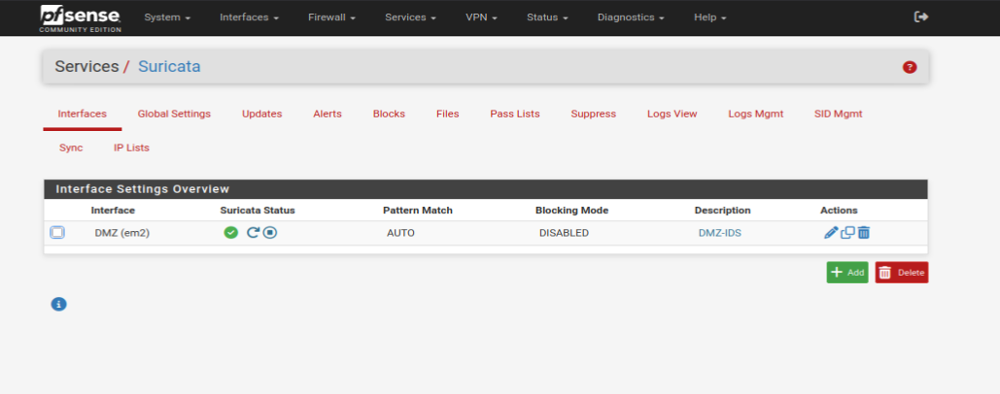

---

## AWS (VPS) Setup

**1. Create the EC2 instance**

- Create an EC2 instance. Ref: [link](https://www.youtube.com/watch?v=ismLPGjdzhk)
- Now in the **Security groups** --> **Inbound** --> **Edit inbound rules** --> **Add rule**
  - Add the below rules
    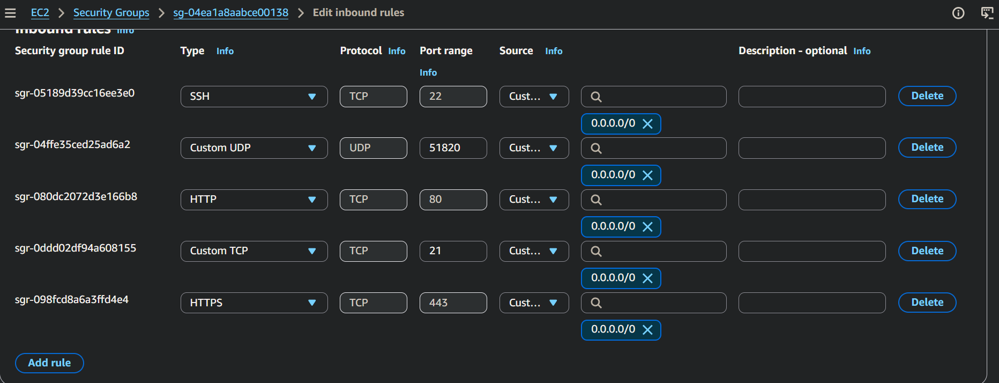
  - Where the 51820 port will be used for wireguard tunnel, port 22 for SSH, port 80/443 for HTTP/HTTPS and 21 for FTP.

    ***Note:*** Don't create unecessary open ports.

---

## WireGuard Setup

WireGuard tunnel between the on-premises Parrot OS analyst machine and the AWS EC2 cloud honeypot instance. This tunnel carries Wazuh log shipping and provides a private, non-public path for administrative SSH access to EC2.

**1. Installing Wireguard**

- On EC2 Ubuntu

    ```bash
    sudo apt update
    sudo apt install wireguard -y
    ```

- On Parrot/On-prem OS

    ```bash
    sudo apt update
    sudo apt install wireguard -y
    ```

**2. Generating Key Pairs**

- On EC2 Ubuntu

    ```bash
    sudo su -
    cd /etc/wireguard
    wg genkey | tee ec2_private.key | wg pubkey > ec2_public.key
    chmod 600 ec2_private.key
    ```

  - Confirm the permission of ec2_private.key is set to 600, restricted to the root user only.

    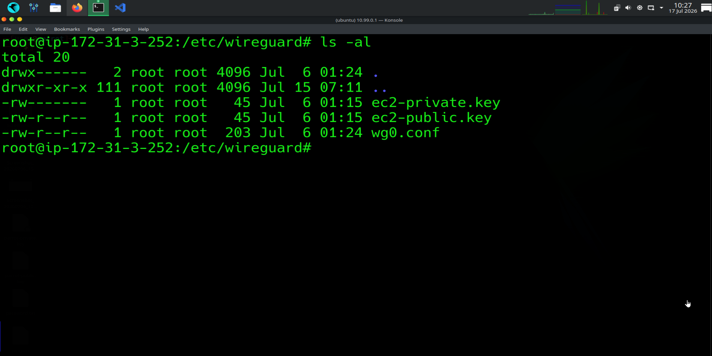
- On parrot/On-prem OS

    ```bash
    sudo su -
    cd /etc/wireguard
    wg genkey | tee parrot_private.key | wg pubkey > parrot_public.key
    chmod 600 parrot_private.key
    ```

***Note:-*** *Never share the private keys*

**3. Configuring of WireGuard**

- On EC2

    ```bash
    sudo nano /etc/wireguard/wg0.conf
    ```

  - Now configure the interface and the peer details:

    ```ini
    [Interface]
    PrivateKey = <Private key of EC2.key>
    Address = 10.99.0.1/24    # Use a subnet that doesn't conflict with any on-prem network.
    ListenPort = 51820

    [Peer]
    PublicKey = <Public Key of on-prem.key>    # public key of the on-prem peer.
    AllowedIPs = 10.99.0.2/32
    ```

- On-Prem

    ```bash
    sudo nano /etc/wireguard/wg0.conf
    ```

  - Now configure the interface and the peer details:

    ```ini
    [Interface]
    PrivateKey = <Private of On-Prem OS.key>
    Address = 10.99.0.2/24

    [Peer]
    PublicKey = <Public key of EC2.key>
    Endpoint = <EC2 public ip>:51820
    AllowedIPs = 10.99.0.1/32
    PersistentKeepalive = 25
    ```

**4. Starting and Persistance**

- On EC2

    ```bash
    sudo wg-quick up wg0 #start
    ```

  - For Persistance

    ```bash
    sudo systemctl enable wg-quick@wg0 #Auto start on boot
    ```

- On-Prem

    ```bash
    sudo wg-quick up wg0
    ```

  - For Persistance

    ```bash
    sudo systemctl enable wg-quick@wg0
    ```

    ***Note:-*** *Since the EC2 instance public ip changes on every stop/start, manual edit of the new public IP in /etc/wireguard/wg0.conf --> endpoint ip --> wg-quick down than up will solve it.*

---

## Honeypot Setup

For this lab I have used the cowrie and opencanary but their are more open source options available like Dionaea or the ultimate T-Pot,

**1. Cowrie**

**1.1 Installation on EC2**

- Install the system dependencies

  ```bash
    sudo apt install git python3-venv python3-pip libssl-dev libffi-dev build-essential -y
    ```

- Create a dedicated, unprivileged system user

    ```bash
    sudo adduser --disabled-password --gecos "" cowrie
    ```

- Clone and install Cowrie

    ```bash
    sudo git clone https://github.com/cowrie/cowrie.git /opt/cowrie
    sudo chown -R cowrie:cowrie /opt/cowrie
    sudo -u cowrie -H bash -c "
    cd /opt/cowrie
    python3 -m venv cowrie-env
    source cowrie-env/bin/activate
    pip install --upgrade pip
    pip install -r requirements.txt
    "
    ```

**1.2 Configuring Cowrie**

```bash
sudo -u cowrie cp /opt/cowrie/etc/cowrie.cfg.dist /opt/cowrie/etc/cowrie.cfg
sudo -u cowrie nano /opt/cowrie/etc/cowrie.cfg
```

*Note:-  Change the hostname from default to any real world produciton server name to trick attackers.*

Eg:-

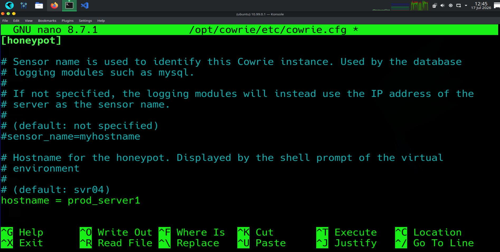

**1.3 Redirect SSH to Cowrie**

As Cowrie runs as the unprivileged cowrie user, it cannot bind to port 22 directly. It listens on port 2222 instead, and this rule redirects inbound traffic from port 22 to port 2222, so external SSH connections land in Cowrie rather than the real system. Administrative access from the on-premises machine still works as intended, since the redirect is scoped to the public interface only SSH to the VPS over the WireGuard tunnel reaches the real sshd untouched.

 ```bash
sudo iptables -t nat -A PREROUTING -i ens5 -p tcp --dport 22 -j REDIRECT --to-port 2222
```

Install the iptables-persistent to save the ip-table rules for avoid reset on every boot.

```bash
sudo apt install iptables-persistent -y
sudo netfilter-persistent save
```

**1.4 Start Cowrie**
Must run as the cowrie user, from Cowrie's own project root (it resolves ./etc/cowrie.cfg as a relative path)

```bash
cd /opt/cowrie
sudo -u cowrie cowrie-env/bin/cowrie start
```

**2. Opencanary**

**2.1 Install dependencies**

```bash
sudo apt-get install python3-dev python3-pip python3-virtualenv python3-venv python3-scapy libssl-dev libpcap-dev -y
```

**2.2 Create a dedicated, unprivileged system user**

```bash
sudo adduser --disabled-password --gecos "" canary
```

**2.3 Set up the virtual environment and install opencanary**

```bash
sudo -u canary -H bash -c "
python3 -m venv /home/canary/canary-env
source /home/canary/canary-env/bin/activate
pip install --upgrade pip
pip install opencanary
"
```

**2.4 Generate and edit the configuration**

```bash
sudo -u canary bash -c "
source /home/canary/canary-env/bin/activate
opencanaryd --copyconfig
"
sudo -u canary nano /home/canary/.opencanary/opencanary.conf
```

Change the default settings to true for ftp, http and https as shown below:
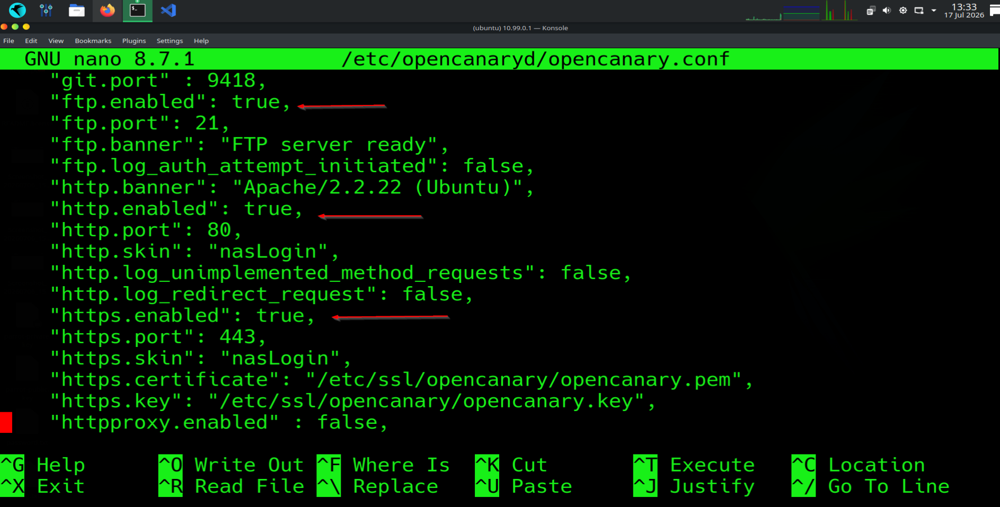

**2.5 Grant the priviledge port binding**

OpenCanary needs to bind to ports below 1024 (21, 80, 443), which an unprivileged user cannot do by default. Rather than running as root, grant the specific capability to the Python binary directly:

```bash
sudo setcap 'cap_net_bind_service=+ep' $(readlink -f $(which python3))
```

**2.6 Start OpenCanary**

```bash
sudo -u canary bash -c "
source /home/canary/canary-env/bin/activate
opencanaryd --start
"
```

***Note:-*** *Confirm no sudo rights are present on cowrie and canary*

```bash
sudo -l -U cowrie
sudo -l -U canary
```

Also confirm password authentication is locked for all three account, so that su into any of these accounts via password is impossible.

```bash
sudo cat /etc/shadow | grep -E 'cowrie|canary|ubuntu'
```

Output should be:
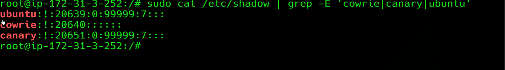

*Note:- The honeypot is currently not boot persistance *

---

## Wazuh Setup

**1 Installing the Wazuh Manager in On-Prem VM**

**1.1 Install the prerequisites**

```bash
sudo apt-get install gnupg apt-transport-https
```

**1.2 Now install the GPG key and repository**

```bash
curl -s https://packages.wazuh.com/key/GPG-KEY-WAZUH | sudo gpg --no-default-keyring --keyring gnupg-ring:/usr/share/keyrings/wazuh.gpg --import && sudo chmod 644 /usr/share/keyrings/wazuh.gpg
echo "deb [signed-by=/usr/share/keyrings/wazuh.gpg] https://packages.wazuh.com/4.x/apt/ stable main" | sudo tee /etc/apt/sources.list.d/wazuh.list
sudo apt update
```

**1.4 Run the all in one installation assistant method**

```bash
curl -sO https://packages.wazuh.com/4.x/wazuh-install.sh
sudo bash wazuh-install.sh -a
```

This will install the wazuh dashboard, indexer, manager at once.

**1.5 Now verify services are running**

```bash
sudo systemctl status wazuh-manager
sudo systemctl status wazuh-indexer
sudo systemctl status wazuh-dashboard
```

All three should show active (running).

**1.6 Access the Wazuh Dashboard** -
Now access the Wazuh Dashboard at the loopback address `https://127.0.0.1`, using the **admin** username and the password generated and displayed at the end of the installation script (Step 1.4).


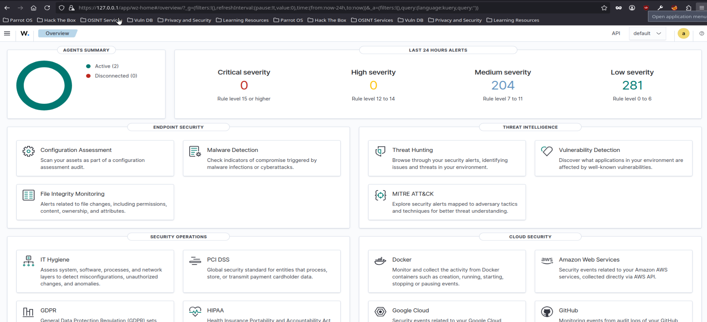

**2. Wazuh Agent Installation on EC2**

**2.1 Install the wazuh agent package**

```bash
curl -so wazuh-agent.deb https://packages.wazuh.com/4.x/apt/pool/main/w/wazuh-agent/wazuh-agent_4.x.x-1_amd64.deb
sudo WAZUH_MANAGER='IP of Wazuh server' dpkg -i wazuh-agent.deb 
```

**2.2 Enable and start the agent**

```bash
sudo systemctl daemon-reload
sudo systemctl enable wazuh-agent
sudo systemctl start wazuh-agent
sudo systemctl status wazuh-agent
```

**2.3 Verify enronllment on the manager side of the on-prem VM**

```bash
sudo /var/ossec/bin/agent_control -l
```

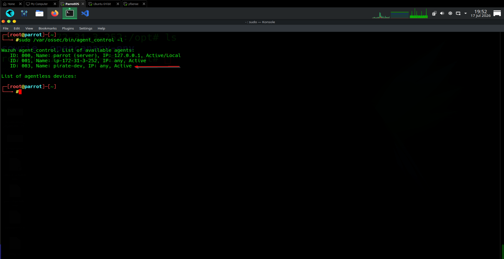

**3. Configuring Log ingestion**

By default, the Wazuh agent monitors standard system logs only. Cowrie and OpenCanary logs need to be explicitly added.

**3.1 Edit the agent's configuration on EC2**

```bash
sudo nano /var/ossec/etc/ossec.conf
```

Scroll down and add the following localfile blocks inside the **ossec_config** section as shown below

```xml
<localfile>
  <log_format>json</log_format>
  <location>/opt/cowrie/var/log/cowrie/cowrie.json</location>
</localfile>

<localfile>
  <log_format>json</log_format>
  <location>/home/canary/.opencanary/opencanary.log</location>
</localfile>
```

**3.2 Restart the agent**

```bash
sudo systemctl restart wazuh-agent
```

**4. Rules for Cowrie and OpenCanary**

Since their is no default detection rules for cowrie and opencanary, I have taken ref: [Martin Yordanov](https://www.linkedin.com/pulse/how-i-set-up-siem-home-lab-martin-yordanov-o617f/).

```bash
sudo nano /var/ossec/etc/rules/local_rules.xml
```

```xml
<group name="cowrie,">
  <rule id="100100" level="5">
    <decoded_as>json</decoded_as>
    <field name="eventid">cowrie.session.connect</field>
    <description>Cowrie: New session connection</description>
  </rule>

  <rule id="100101" level="7">
    <decoded_as>json</decoded_as>
    <field name="eventid">cowrie.login.failed</field>
    <description>Cowrie: Failed SSH login attempt</description>
  </rule>

  <rule id="100102" level="15">
    <decoded_as>json</decoded_as>
    <field name="eventid">cowrie.login.success</field>
    <description>CRITICAL: Successful unauthorized login to Cowrie honeypot</description>
  </rule>

  <rule id="100103" level="12">
    <decoded_as>json</decoded_as>
    <field name="eventid">cowrie.session.file_download</field>
    <description>Cowrie: File download attempt detected — possible payload retrieval</description>
  </rule>

  <rule id="100106" level="10">
    <decoded_as>json</decoded_as>
    <field name="eventid">cowrie.command.input</field>
    <description>Cowrie: Command executed by attacker post-login</description>
  </rule>
</group>

```

For OpenCanary rules create a new group for opencanary.

```xml
<group name="opencanary,">
  <rule id="100110" level="6">
    <decoded_as>json</decoded_as>
    <field name="logtype">^2000$</field>
    <description>OpenCanary: FTP login attempt detected</description>
  </rule>

  <rule id="100111" level="8">
    <decoded_as>json</decoded_as>
    <field name="logtype">^3001$</field>
    <description>OpenCanary: HTTP login attempt detected</description>
  </rule>

  <rule id="100112" level="4">
    <decoded_as>json</decoded_as>
    <field name="logtype">^3004$</field>
    <description>OpenCanary: HTTP scan detected (multiple GET requests to random URLs)</description>
  </rule>
</group>
```

Now restart the manager to load the new rules ref: [Canary API Docs](https://docs.canary.tools/incidents/incident-objects.html#http-service-scan)

```bash
sudo systemctl restart wazuh-manager
```

**5. Suricate Log ingestion on Wazuh**

**5.1 Configure pfSense to forward systemlogs to Wazuh**

- Go to **Status** --> **System Logs** --> **Settings**.
- Scroll to **Remote Logging Options** --> **Enable Remote Logging** --> Check the **Send log messages to remote syslog server**
- Under **Remote log servers**, enter on-prem/wazuh manager machine LAN IP and the syslog port 514 for UDP. As well as in **Remote Syslog Contents** check the **System Events**, **Firewall Events** and save it.
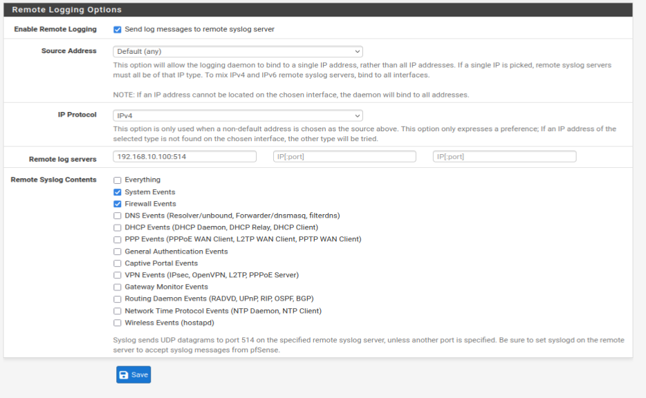

**5.2 Configure Wazuh to Receive and Parse the Forwarded Syslog**

```bash
sudo nano /var/ossec/etc/ossec.conf
```

Find remote block and add the new remote block with the IP of the DMZ default gateway.  

```xml
<remote>
  <connection>syslog</connection>
  <port>514</port>
  <protocol>udp</protocol>
  <allowed-ips>192.168.20.1</allowed-ips>
</remote>
```

**5.3 Configure the local decoder**

```bash
sudo nano /var/ossec/etc/decoders/local_decoder.xml
```

Add:

```xml
<decoder name="suricata-syslog">
  <program_name>suricata</program_name>
</decoder>

<decoder name="suricata-syslog-json">
  <parent>suricata-syslog</parent>
  <prematch>\{"timestamp"</prematch>
  <plugin_decoder>JSON_Decoder</plugin_decoder>
</decoder>
```

**Restart the Wazuh manager**

```bash
sudo systemctl restart wazuh-manager
```

Finally the setup is wazuh setup is over, below are the wazuh alerts:

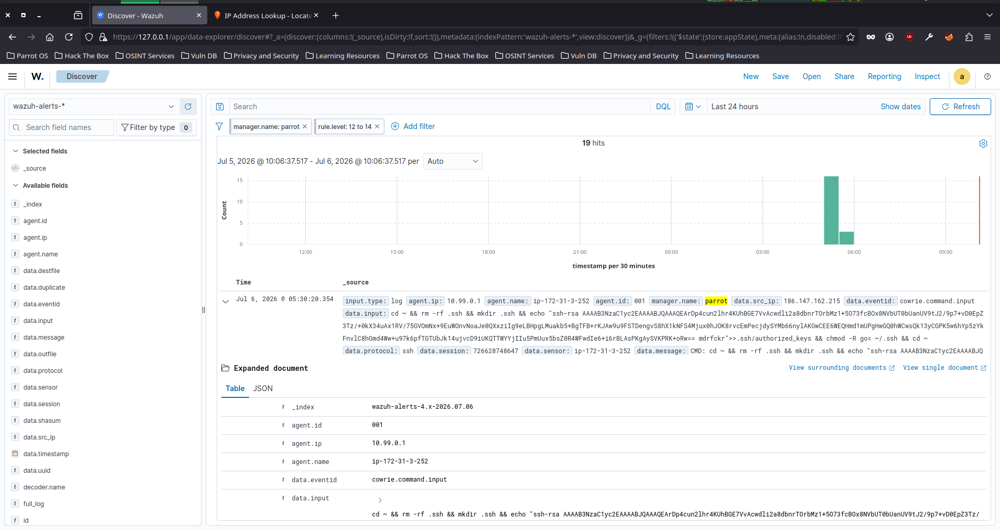

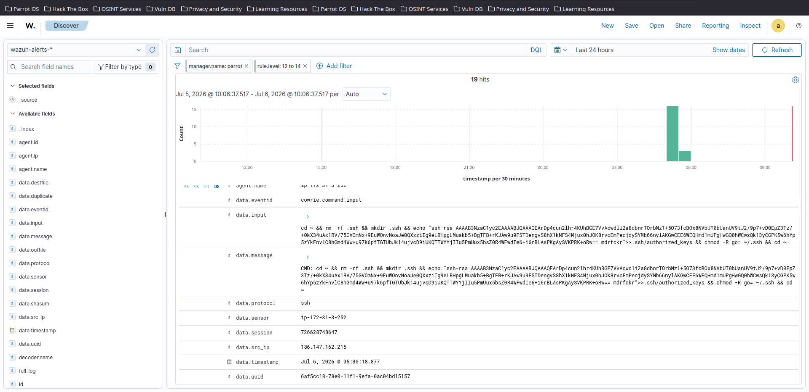

---

